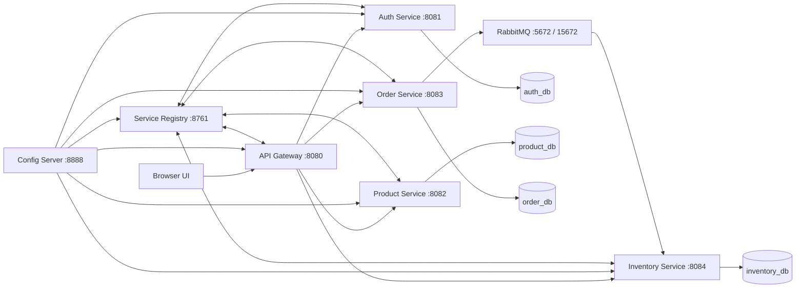

# Ecommerce Microservices

A Spring Boot ecommerce microservices workspace with centralized configuration, service discovery, API gateway routing, JWT-based authentication, RabbitMQ-backed order processing, Flyway migrations, and a UI served by the gateway.

## Modules

- `config-server` - centralized configuration server
- `service-registry` - Eureka service discovery
- `auth-service` - registration, login, JWT generation, token validation
- `product-service` - product catalog management
- `inventory-service` - stock ownership and stock mutation
- `order-service` - order creation and asynchronous inventory coordination
- `api-gateway` - single entry point for UI and APIs

## Tech Stack

- Java 17
- Spring Boot 3.4.1
- Spring Cloud 2024.0.0
- Spring Security
- Spring Cloud Gateway
- Spring Cloud Config Server
- Netflix Eureka
- OpenFeign
- RabbitMQ
- MySQL
- Spring Data JPA
- Flyway
- Maven

## Architecture



## Request Flow

1. User accesses the UI from `http://localhost:8080/`
2. API Gateway routes requests to downstream services
3. `auth-service` issues JWTs for authenticated users
4. `product-service` owns catalog data
5. `inventory-service` is the source of truth for stock
6. `order-service` creates orders and publishes inventory work through RabbitMQ
7. `inventory-service` processes stock requests asynchronously and order state moves to `CREATED` or `CANCELLED`

## Features

- Centralized config with Config Server
- Service discovery with Eureka
- Gateway-based routing for `/auth/**`, `/products/**`, `/orders/**`, `/inventory/**`
- Role-based authorization for admin-only operations
- Inventory as the single stock source of truth
- RabbitMQ-based asynchronous order flow
- Flyway database migrations
- Correlation ID propagation in logs
- Paginated product and order listing
- Gateway-hosted UI for login, product browsing, ordering, admin actions, and architecture view

## Prerequisites

- Java 17+
- Maven 3.9+
- MySQL 8+
- RabbitMQ

RabbitMQ can be started automatically through `docker-compose.yml` by the launcher if Docker is available.

## Environment Setup

Copy values from [`.env.example`](./.env.example) into a local `.env` file in the project root.

Important:

- Keep `.env.example` in the repository
- Keep `.env` only on your machine
- Do not commit real secrets

Main variables:

- `JWT_PRIVATE_KEY`
- `JWT_PUBLIC_KEY`
- `AUTH_DB_PASSWORD`
- `PRODUCT_DB_PASSWORD`
- `INVENTORY_DB_PASSWORD`
- `ORDER_DB_PASSWORD`
- `AUTH_BOOTSTRAP_ADMIN_ENABLED`
- `AUTH_BOOTSTRAP_ADMIN_EMAIL`
- `AUTH_BOOTSTRAP_ADMIN_PASSWORD`

## Running the Application

### Windows

```powershell
.\run-all.cmd
```

Skip build:

```powershell
.\run-all.cmd --skip-build
```

Stop all services:

```powershell
.\stop-all.cmd
```

### PowerShell Launcher

```powershell
.\run-all.ps1
```

### Bash

```bash
./run-all.sh
```

Stop:

```bash
./stop-all.sh
```

## Service URLs

- UI and Gateway: `http://localhost:8080`
- Config Server: `http://localhost:8888`
- Eureka Dashboard: `http://localhost:8761`
- Auth Service: `http://localhost:8081`
- Product Service: `http://localhost:8082`
- Order Service: `http://localhost:8083`
- Inventory Service: `http://localhost:8084`
- RabbitMQ Management: `http://localhost:15672`

## Main API Endpoints

### Auth

- `POST /auth/register`
- `POST /auth/login`
- `GET /auth/validate`
- `POST /auth/logout`

### Products

- `GET /products?page=0&size=10`
- `GET /products/{productId}`
- `POST /products`

### Orders

- `GET /orders?page=0&size=10`
- `GET /orders/{orderId}`
- `POST /orders`

### Inventory

- `GET /inventory/{productId}`
- `GET /inventory/batch?productIds=1&productIds=2`
- `POST /inventory/add`
- `POST /inventory/reduce`

## Admin Bootstrap

The project supports one-time admin bootstrap through env variables:

- `AUTH_BOOTSTRAP_ADMIN_ENABLED=true`
- `AUTH_BOOTSTRAP_ADMIN_FULL_NAME=Admin User`
- `AUTH_BOOTSTRAP_ADMIN_EMAIL=admin@example.com`
- `AUTH_BOOTSTRAP_ADMIN_PASSWORD=Admin@123`

Recommended usage:

1. Enable bootstrap once
2. Start the app
3. Log in with the admin account
4. Set `AUTH_BOOTSTRAP_ADMIN_ENABLED=false`
5. Restart

## Database Migrations

Flyway is enabled for the database-backed services:

- `auth-service`
- `product-service`
- `inventory-service`
- `order-service`

Hibernate validates schema instead of mutating it at runtime.

## Logging

Logs are written under the root `logs/` folder.

Examples:

- `logs/auth-service.log`
- `logs/product-service.log`
- `logs/inventory-service.log`
- `logs/order-service.log`
- `logs/api-gateway.log`

Correlation IDs are propagated through the gateway and downstream services.

## UI

The UI is served directly by `api-gateway` at:

- `http://localhost:8080/`

It includes:

- account screen
- products
- orders
- admin tools
- architecture tab with application flow view

## Health Checks

Use:

- `http://localhost:8080/actuator/health`
- `http://localhost:8081/actuator/health`
- `http://localhost:8082/actuator/health`
- `http://localhost:8083/actuator/health`
- `http://localhost:8084/actuator/health`

Expected response:

```json
{"status":"UP"}
```

## Current Status

The main application flow is working:

- services start successfully
- gateway routing works
- product creation works
- order creation works
- asynchronous inventory processing works
- paginated product and order APIs work

Known note:

- the newer cookie-based browser auth flow still needs one more refinement pass; the core token-based backend flow is working

## Build

From the project root:

```powershell
mvn -f pom.xml clean install
```

## License

Add your preferred license here before publishing publicly.
